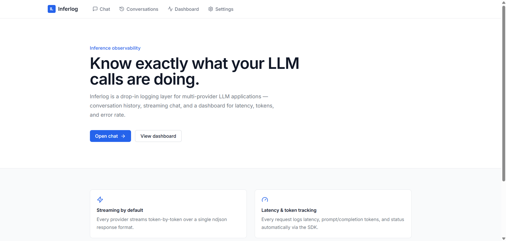
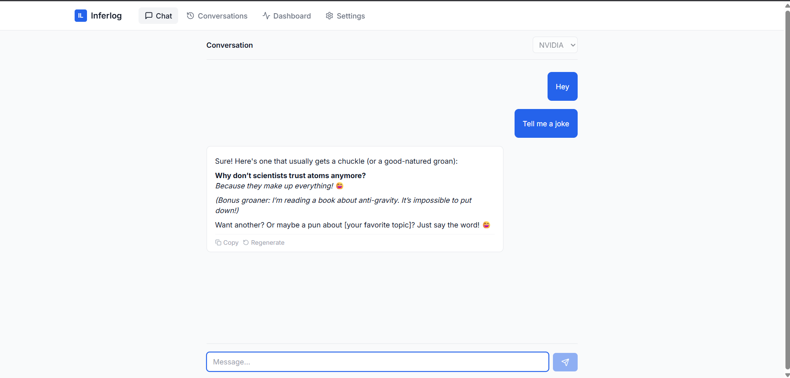
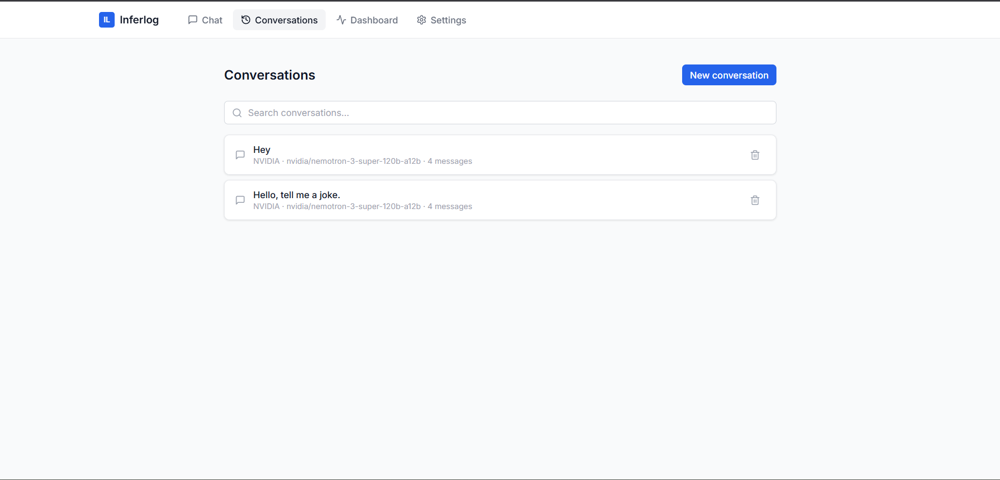
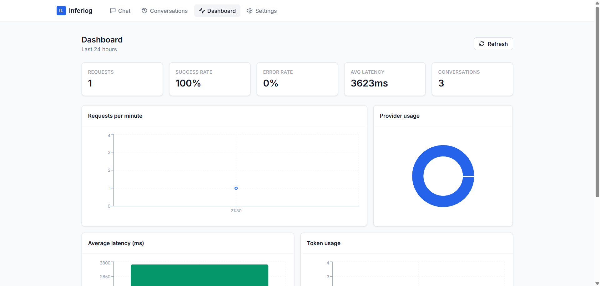

# InferLog

A lightweight logging and observability platform for multi-provider LLM applications — a streaming chat interface, conversation history, and a live dashboard tracking latency, token usage, and error rate across providers, backed by a drop-in SDK that ships inference logs asynchronously so logging never blocks a request.

**Live demo:** [inferlog-gamma.vercel.app](https://inferlog-gamma.vercel.app/)

---

## Table of contents

- [Features](#features)
- [Architecture](#architecture)
- [Folder structure](#folder-structure)
- [Schema design](#schema-design)
- [Setup](#setup)
- [Provider configuration](#provider-configuration)
- [Ingestion flow & logging strategy](#ingestion-flow--logging-strategy)
- [Scaling considerations](#scaling-considerations)
- [Failure handling assumptions](#failure-handling-assumptions)
- [Tradeoffs](#tradeoffs)
- [Future improvements](#future-improvements)
- [Screenshots](#screenshots)

---

## Features

- **Multi-turn chat** with streaming responses and persisted conversation history
- **Multi-provider support** — NVIDIA, OpenAI, Claude, and Gemini behind a single `AIProvider` interface
- **Drop-in logging SDK** that wraps any provider call and captures inference metadata without adding latency to the request path
- **Ingestion API** that validates, redacts, and persists logs in near real time
- **Dashboard** with latency, token usage, and error-rate charts
- **Conversation management** — list, resume, and cancel a conversation from the UI
- **Docker Compose** one-command setup

## Architecture

```
┌─────────────┐      POST /api/chat (stream)      ┌──────────────────┐
│  Chat UI    │ ─────────────────────────────────▶ │  Route Handler   │
│  (client)   │ ◀───────── ndjson stream ────────── │  /api/chat       │
└─────────────┘                                     └────────┬─────────┘
                                                              │ uses
                                                              ▼
                                                     ┌──────────────────┐
                                                     │  LoggedProvider  │  sdk/wrapper.ts
                                                     │  (SDK wrapper)   │
                                                     └────────┬─────────┘
                                                              │ delegates to
                                                              ▼
                                                     ┌──────────────────┐
                                                     │   AIProvider     │  src/lib/providers/*
                                                     │ NVIDIA / OpenAI /│
                                                     │ Claude / Gemini  │
                                                     └────────┬─────────┘
                                                              │ fire-and-forget
                                                              ▼
                                          POST /api/logs  ┌──────────────────┐
                                        ◀─────────────────│ InferenceLogger  │  sdk/logger.ts
                                                           └──────────────────┘
                                                              │
                                                              ▼
                                                     ┌──────────────────┐
                                                     │  Ingestion route │  validates (Zod),
                                                     │  /api/logs       │  redacts PII, persists
                                                     └────────┬─────────┘
                                                              │ emits
                                                              ▼
                                                     ┌──────────────────┐
                                                     │   Event bus      │  src/lib/events.ts
                                                     │ "inference.logged"│ (Node EventEmitter)
                                                     └────────┬─────────┘
                                                              │
                                              ┌───────────────┴────────────────┐
                                              ▼                                ▼
                                     ┌──────────────┐                ┌──────────────────┐
                                     │  PostgreSQL  │                │  Dashboard        │
                                     │  (Prisma)    │◀───────────────│  /api/dashboard/* │
                                     └──────────────┘   polls (15s)  └──────────────────┘
```

**Why this shape:** the chat route owns conversation persistence, so history survives even if a client disconnects mid-stream. Inference logging is treated as a *separate* concern, handled entirely by the SDK and the ingestion endpoint — the SDK wraps any `AIProvider` and never throws on log failure, because a logging outage must never break inference. The event bus decouples ingestion from anything that reacts to it; today that's just the dashboard's next poll, but it's the seam where webhooks, alerting, or a message queue could be hung later without touching the ingestion route itself.

## Folder structure

```
inference-logger/
├── prisma/
│   └── schema.prisma          # Conversation, Message, InferenceLog models
├── sdk/                        # Standalone logging SDK
│   ├── client.ts               # createLoggedProvider() entry point
│   ├── wrapper.ts              # LoggedProvider — wraps chat()/stream()
│   ├── logger.ts               # Fire-and-forget log shipper
│   └── types.ts
├── src/
│   ├── app/
│   │   ├── page.tsx             # Landing
│   │   ├── chat/                # Chat UI (streaming, markdown, retry, cancel)
│   │   ├── conversations/       # History, search, delete
│   │   ├── dashboard/           # Recharts analytics
│   │   ├── settings/            # Provider configuration status
│   │   ├── not-found.tsx
│   │   └── api/
│   │       ├── chat/route.ts            # Streaming chat endpoint
│   │       ├── logs/route.ts            # Ingestion endpoint
│   │       ├── conversations/           # CRUD
│   │       ├── dashboard/stats/route.ts # Aggregated metrics
│   │       └── settings/route.ts
│   ├── components/              # Button, Card, Badge, Nav, ErrorBoundary
│   ├── hooks/use-toast.tsx
│   └── lib/
│       ├── providers/           # AIProvider abstraction (NVIDIA/OpenAI/Claude/Gemini)
│       ├── db.ts                # Prisma client singleton
│       ├── events.ts            # Event bus
│       ├── pii.ts               # Redaction rules
│       └── validation.ts        # Zod schemas
├── screenshots/                 # App screenshots referenced below
├── docker-compose.yml
├── Dockerfile
└── .env.example
```

## Schema design

```
┌────────────────────┐        ┌────────────────────┐        ┌────────────────────┐
│    Conversation     │        │      Message        │        │    InferenceLog     │
├────────────────────┤        ├────────────────────┤        ├────────────────────┤
│ id             PK   │◀──┐    │ id             PK   │◀──┐    │ id             PK   │
│ title                │   │    │ conversationId FK────┘    │ requestId      UQ   │
│ provider             │   └────────conversationId FK ──────┤ conversationId FK   │
│ model                │        │ role                 │    │ messageId      FK   │
│ createdAt            │        │ content              │    │ provider             │
│ updatedAt            │        │ createdAt            │    │ model                │
└────────────────────┘        └────────────────────┘        │ promptPreview        │
                                                               │ completionPreview    │
                                                               │ promptTokens         │
                                                               │ completionTokens     │
                                                               │ totalTokens          │
                                                               │ latencyMs            │
                                                               │ status               │
                                                               │ errorMessage         │
                                                               │ createdAt            │
                                                               └────────────────────┘
```

- `Message → Conversation` and `InferenceLog → Conversation` both **cascade on delete** — deleting a conversation cleans up everything attached to it.
- `InferenceLog → Message` **sets null on delete** — logs are kept for audit/analytics purposes even if a single message is pruned.
- `requestId` is unique on `InferenceLog`, so a retried or duplicated log ship is idempotent at the database level instead of relying on the SDK to dedupe.
- Prompt/completion content is stored as bounded **previews**, not full text, keeping log rows small and avoiding storing potentially sensitive full conversation content twice.

## Setup

### Option A — Docker (recommended)

```bash
cp .env.example .env
# edit .env and set NVIDIA_API_KEY

docker compose up --build
```

The app runs migrations on boot and is available at `http://localhost:3000`.

### Option B — Local

```bash
npm install
cp .env.example .env
# point DATABASE_URL at a local Postgres instance, set NVIDIA_API_KEY

npx prisma migrate dev --name init
npm run dev
```

## Provider configuration

Only NVIDIA is required to exercise the app end-to-end:

```
NVIDIA_API_KEY=<placeholder>
NVIDIA_MODEL=nvidia/nemotron-3-super-120b-a12b
```

OpenAI, Claude, and Gemini implement the same `AIProvider` interface (`src/lib/providers/*`) and activate automatically once their respective API keys are set — no code changes required. Selecting an unconfigured provider in the chat UI surfaces a clear error rather than failing silently.

## Ingestion flow & logging strategy

1. The chat route streams tokens to the client and, in parallel, calls the LLM through `LoggedProvider` (the SDK wrapper).
2. The wrapper times the call, captures token usage, status, and errors, and builds a log payload — independent of whether the underlying stream succeeds or fails.
3. `InferenceLogger` ships that payload to `/api/logs` **fire-and-forget**: the shipping call is never `await`-ed on the request/response path, so a slow or failing ingestion endpoint cannot add latency to the chat experience.
4. `/api/logs` validates the payload with Zod, runs it through the PII redaction rules, and persists it via Prisma.
5. On successful persistence, the route emits an `inference.logged` event on the in-process event bus.
6. The dashboard polls `/api/dashboard/stats` every 15 seconds to render aggregated latency/token/error metrics; the event bus is the seam where a future push-based subscriber (SSE, webhook, queue consumer) would attach instead.

## Scaling considerations

- Add a read replica and point `/api/dashboard/stats` at it — the aggregation query is read-only and safe to isolate from write traffic.
- Move the event bus to Redis pub/sub (or a queue) once logging needs to fan out across multiple app instances instead of a single Node process.
- Partition `inference_logs` by `createdAt` once volume makes the dashboard's scan window expensive.
- The SDK's fire-and-forget shipping already decouples inference latency from ingestion throughput, so ingestion can be scaled independently of the chat path.

## Failure handling assumptions

- Logging failures are non-fatal by design: `LoggedProvider` never throws on a failed log ship, so a broken or overloaded ingestion endpoint degrades observability, not the user-facing chat experience.
- If a client disconnects mid-stream, the conversation and any messages already persisted remain intact — the chat route owns persistence independently of the streaming connection.
- Duplicate or retried log submissions are handled at the database level via the unique `requestId` constraint on `InferenceLog`.
- Malformed or invalid log payloads are rejected at the ingestion boundary by Zod validation rather than being written to the database and cleaned up later.

## Tradeoffs

- **Polling over websockets for the dashboard.** A 15s poll is simpler to reason about and sufficient for an analytics view; a websocket/SSE push would be the next step if sub-second freshness mattered.
- **EventEmitter instead of a message broker.** Correct for a single-process deployment and keeps the event contract explicit; swapping in Redis pub/sub or a queue means changing `src/lib/events.ts` only, not any call sites.
- **Regex-based PII redaction.** Cheap and dependency-free, covers the required categories, but isn't a substitute for a proper NER-based redaction service at higher accuracy requirements.
- **Title generation is heuristic (first 60 characters), not LLM-generated**, to avoid a second inference call — and therefore cost and latency — on every new conversation.
- **Prompt/completion previews instead of full text.** Keeps log rows small and reduces duplicated sensitive content in storage, at the cost of not having the full raw text available for later replay/debugging from the log table alone.

## Future improvements

- Server-Sent Events for the dashboard instead of polling.
- Per-user auth and API keys for the ingestion endpoint.
- Configurable retention policy for inference logs.
- Streaming token-level cost estimation per provider.
- Self-hosted Kubernetes deployment manifests.

## Screenshots

| Landing  | Chat |
|---|---|
|  |  |

| Conversations  | Dashboard  |
|---|---|
|  |  |


## Deployment

The `Dockerfile` builds a standalone-ish production image; deploy `app` and `postgres` from `docker-compose.yml` to any container host (Fly.io, Railway, ECS). Set `DATABASE_URL` and provider keys as environment/secret variables — never commit `.env`.
